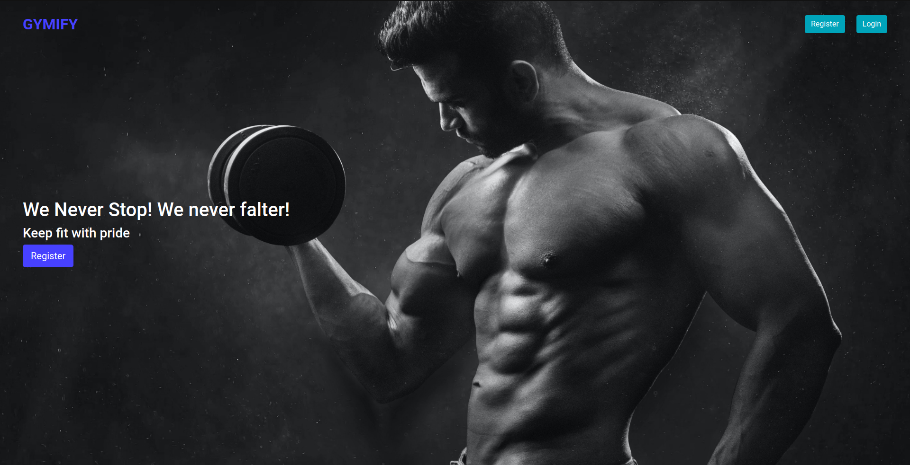
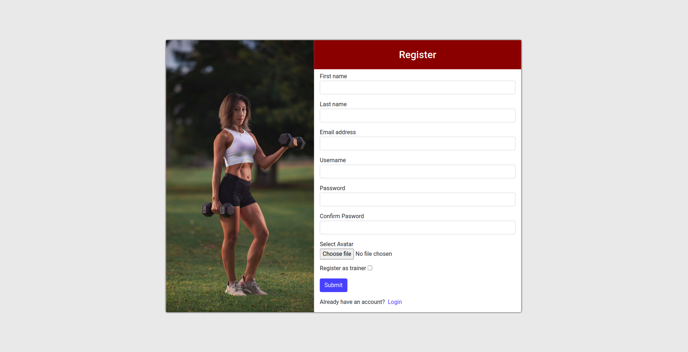
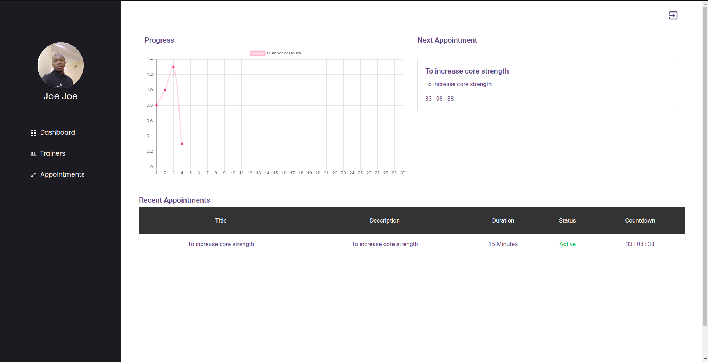

# GYMIFY
This is a web application that enables users to book an appointment with a gym instructor. This application serves as a frontend application to consume a [Ruby on Rails API](https://github.com/OlawaleJoseph/Gymify-Backend).

[Demo Link](https://gymify-app.netlify.app/)
 

### Production Dependencies

| **Dependency**   | **Use**                                              |
| ---------------- | ---------------------------------------------------- |
| prop-types       | Declare types for props passed into React components |
| react            | React library                                        |
| react-dom        | React library for DOM rendering                      |
| react-redux      | Connects React components to Redux                   |
| react-router-dom | React library for routing                            |
| redux            | Library for unidirectional data flows                |
| redux-thunk      | Async redux library middleware                       |
| axios            | Make HTTP calls                                      |
| react-chartjs-2  | To create chart                                      |

 
 

### Development Dependencies

| **Dependency**                  | **Use**                                                          |
| ------------------------------- | ---------------------------------------------------------------- |
| babel-eslint                    | Lint modern JavaScript via ESLint                                |
| eslint                          | Lints JavaScript                                                 |
| eslint-plugin-react-hooks       | Adds additional React-hooks-related rules to ESLint              |
| eslint-plugin-import            | Advanced linting of ES6 imports                                  |
| eslint-plugin-react             | Adds additional React-related rules to ESLint                    |
| jest                            | Automated testing framework                                      |
| enzyme                          | Test components, and write assertions                            |
| enzyme-adapter-react-16         | React adapter for enzyme                                         |
| stylelint                       | Lints Css                                                        |
| stylelint-config-standard       | Advanced linting configoration for css                           |
| stylelint-csstree-validator     | Advanced linting validation for css                              |

## Prerequisites
- Internet
- Computer

### Install and Setup
- Clone repo to your local `git clone git@github.com:OlawaleJoseph/gymify-frontend.git`
- cd into the cloned repo
- Open a terminal in the root of the app
- Run `npm install- You can access all the design info (color, typography, layouts) in this link:
- [Design](https://www.behance.net/gallery/26425031/Vespa-Responsive-Redesign)
- ` to install dependencies
- Run Start up your server with `npm run start`
- Open http://localhost:3000/ in your browser.

### Testing
- Open a terminal and run `npm run test`.

## Author

👤 **Adedeko Olawale**

- Github: [@OlawaleJoseph](https://github.com/OlawaleJoseph)
- Twitter: [@javanode123](https://twitter.com/javanode123)
- Linkedin: [olawale-adedeko](http://www.linkedin.com/in/olawale-adedeko)

## 🤝 Contributing

Contributions, issues and feature requests are welcome!

Feel free to check the [issues page](https://github.com/OlawaleJoseph/gymify-frontend/issues).

## Show your support

Give a ⭐️ if you like this project!

## Acknowledgments
- Microverse
- You can access all the design info (color, typography, layouts) in this link:
- [Design](https://www.behance.net/gallery/26425031/Vespa-Responsive-Redesign)
- Design idea by [ Murat Korkmaz on Behance](https://www.behance.net/muratk)
## 📝 License